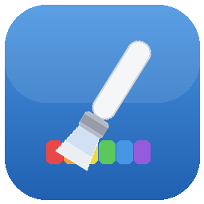

<div align="center">
  
  <h1>paint.software</h1>
  <p><strong>An open-source clone of Paint.NET for Linux — built with C++ &amp; Qt6.</strong></p>

  [](https://github.com/Univers4craft/paint.software/actions/workflows/ci.yml)
  [](LICENSE)
  [](CMakeLists.txt)
  [](https://www.qt.io/)
</div>

> **Keywords:** paint.net clone · paint.net for Linux · paint dot net alternative · open-source image editor · photo editor · raster graphics editor · Qt6 · C++

---

## 🇬🇧 English

**paint.software** is a free and open-source raster image editor that reproduces the look and feel of
[**Paint.NET**](https://www.getpaint.net/) on Linux. It aims to be a familiar, lightweight
**Paint.NET alternative** with layers, blend modes, selections, effects and adjustments — all native,
with no .NET runtime required.

Anyone is welcome to **use it, build it, and improve it.** Every change is reviewed and merged with the
maintainer's final approval (see [Contributing](#-contributing--en)).

### ✨ Features
- **Layers** with opacity, blend modes, live thumbnails, and smart merge
- **Tools:** paintbrush, pencil, eraser, paint bucket, gradient, shapes, line, text, clone stamp,
  color picker, recolor, magic wand, lasso & rectangle selection, move, zoom, pan
- **Adjustments:** Brightness/Contrast, Hue/Saturation, Levels, Curves, Black & White, Sepia,
  Posterize, Color Balance, Exposure, Highlights/Shadows, Temperature/Tint, Invert…
- **30+ effects:** blurs, sharpen, emboss, edge detect, oil paint, pixelate, distortions, drop shadow…
- **Selections** with feather / grow / shrink, confined editing, and marquee move
- **Non-destructive history** with click-to-navigate undo/redo, plus autosave / crash recovery
- **UI in French & English**, light & dark themes matching Paint.NET
- **Multi-document**, rulers (px / inches / cm), and infinite canvas

### 🛠️ Build from source
Requirements: a C++17 compiler, **CMake ≥ 3.16**, and **Qt 6** (Widgets, Gui, Core, PrintSupport).

```bash
# Debian / Ubuntu / Linux Mint
sudo apt install build-essential cmake qt6-base-dev libgl1-mesa-dev

# Configure & build
cmake -B build
cmake --build build -j

# Run
./build/paintdotnet
```

Run the headless test suite:
```bash
cmake --build build --target paintdotnet_tests
QT_QPA_PLATFORM=offscreen ./build/paintdotnet_tests
```

### 🤝 Contributing {#-contributing--en}
Contributions are open to **everyone**. The workflow keeps the project safe while letting anyone help:

1. **Fork** the repository.
2. Create a branch: `git checkout -b my-feature`.
3. Make your change and make sure it **builds and the tests pass**.
4. Open a **Pull Request**. GitHub Actions will build and test it automatically.
5. The maintainer reviews it and gives the **final approval** before it is merged.

You do **not** need write access to contribute — forks + pull requests are all it takes.
See [CONTRIBUTING.md](CONTRIBUTING.md) for details.

### 📄 License
Released under the [MIT License](LICENSE) — free to use, modify and redistribute.

### ⚖️ Disclaimer
paint.software is an **independent community project**. It is **not affiliated with, endorsed by, or
sponsored by dotPDN LLC or Rick Brewster**, the creators of Paint.NET. "Paint.NET" and "paint.net" are
referenced only to describe the software this project is inspired by and compatible with.

---

## 🇫🇷 Français

**paint.software** est un éditeur d'images matricielles **libre et open source** qui reproduit
l'apparence et le fonctionnement de [**Paint.NET**](https://www.getpaint.net/) sous Linux. Son but est
d'offrir une **alternative à Paint.NET** légère et familière, avec calques, modes de fusion, sélections,
effets et ajustements — le tout natif, sans runtime .NET.

Tout le monde est invité à **l'utiliser, le compiler et l'améliorer.** Chaque modification est relue et
fusionnée après **mon approbation finale** en tant que mainteneur (voir [Contribuer](#-contribuer--fr)).

### ✨ Fonctionnalités
- **Calques** avec opacité, modes de fusion, miniatures en direct et fusion intelligente
- **Outils :** pinceau, crayon, gomme, pot de peinture, dégradé, formes, ligne, texte, tampon de clonage,
  pipette, recoloration, baguette magique, lasso & sélection rectangulaire, déplacement, zoom, main
- **Ajustements :** Luminosité/Contraste, Teinte/Saturation, Niveaux, Courbes, Noir & blanc, Sépia,
  Postérisation, Balance des couleurs, Exposition, Hautes/Basses lumières, Température/Teinte, Inverser…
- **30+ effets :** flous, netteté, relief, détection de contours, peinture à l'huile, pixelisation,
  distorsions, ombre portée…
- **Sélections** avec adoucissement / dilatation / contraction, édition confinée et déplacement du contour
- **Historique non destructif** avec navigation au clic, plus sauvegarde auto / récupération après plantage
- **Interface en français & anglais**, thèmes clair & sombre calqués sur Paint.NET
- **Multi-documents**, règles (px / pouces / cm) et canevas infini

### 🛠️ Compiler depuis les sources
Prérequis : un compilateur C++17, **CMake ≥ 3.16** et **Qt 6** (Widgets, Gui, Core, PrintSupport).

```bash
# Debian / Ubuntu / Linux Mint
sudo apt install build-essential cmake qt6-base-dev libgl1-mesa-dev

# Configurer & compiler
cmake -B build
cmake --build build -j

# Lancer
./build/paintdotnet
```

Lancer les tests (sans interface) :
```bash
cmake --build build --target paintdotnet_tests
QT_QPA_PLATFORM=offscreen ./build/paintdotnet_tests
```

### 🤝 Contribuer {#-contribuer--fr}
Les contributions sont ouvertes à **tout le monde**. Le processus protège le projet tout en laissant
chacun participer :

1. **Forkez** le dépôt.
2. Créez une branche : `git checkout -b ma-fonctionnalite`.
3. Faites votre modification et vérifiez qu'elle **compile et que les tests passent**.
4. Ouvrez une **Pull Request**. GitHub Actions la compile et la teste automatiquement.
5. Le mainteneur la relit et donne l'**approbation finale** avant la fusion.

Aucun accès en écriture n'est nécessaire pour contribuer — un fork + une pull request suffisent.
Voir [CONTRIBUTING.md](CONTRIBUTING.md) pour les détails.

### 📄 Licence
Distribué sous [licence MIT](LICENSE) — libre d'utilisation, de modification et de redistribution.

### ⚖️ Avertissement
paint.software est un **projet communautaire indépendant**. Il **n'est ni affilié, ni approuvé, ni
sponsorisé par dotPDN LLC ou Rick Brewster**, les créateurs de Paint.NET. Les termes « Paint.NET » et
« paint.net » ne sont utilisés que pour décrire le logiciel dont ce projet s'inspire.
