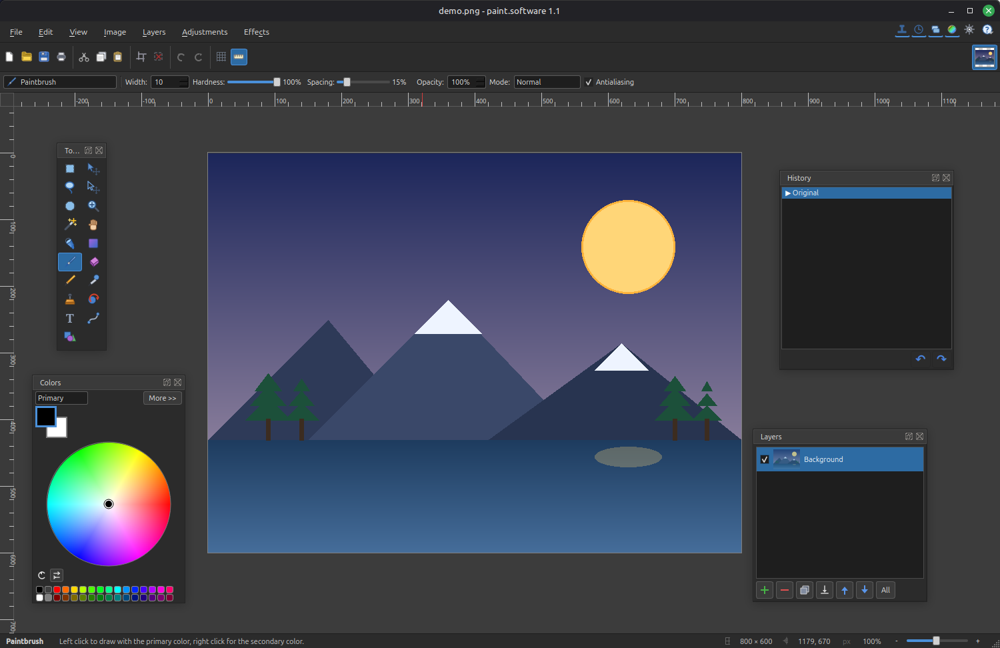

<div align="center">
  
  <h1>paint.software</h1>
  <p><strong>An open-source clone of Paint.NET for Linux — built with C++ &amp; Qt6.</strong></p>

  [](https://github.com/Univers4craft/paint.software/actions/workflows/ci.yml)
  [](LICENSE)
  [](CMakeLists.txt)
  [](https://www.qt.io/)
</div>

<div align="center">
  
</div>

> **Keywords:** paint.net clone · paint.net for Linux · paint dot net alternative · open-source image editor · photo editor · raster graphics editor · Qt6 · C++

---

## 🇬🇧 English

**paint.software** is a free and open-source raster image editor that reproduces the look and feel of
[**Paint.NET**](https://www.getpaint.net/) on Linux. It aims to be a familiar, lightweight
**Paint.NET alternative** with layers, blend modes, selections, effects and adjustments — all native,
with no .NET runtime required.

Anyone is welcome to **use it, build it, and improve it.** Every change is reviewed and merged with the
maintainer's final approval (see [Contributing](#-contributing--en)).

### ✨ Features
- **Layers** with opacity, blend modes, live thumbnails, and smart merge
- **Native `.psw` format** that saves and reloads your full layer stack (or export flat to PNG/JPEG/…)
- **Text tool** with font, size, **bold / italic / underline**
- **Tools:** paintbrush, pencil, eraser, paint bucket, gradient, shapes, line, text, clone stamp,
  color picker, recolor, magic wand, lasso & rectangle selection, move, zoom, pan
- **Adjustments:** Brightness/Contrast, Hue/Saturation, Levels, Curves, Black & White, Sepia,
  Posterize, Color Balance, Exposure, Highlights/Shadows, Temperature/Tint, Invert…
- **30+ effects:** blurs, sharpen, emboss, edge detect, oil paint, pixelate, distortions, drop shadow…
- **Live-preview dialogs** for adjustments and effects (see the result as you drag the sliders)
- **Plugin system** — load external effect plugins (native C ABI) that appear under Effects ▸ Plugins, just like Paint.NET ([how to write one](plugins/README.md)). A sample plugin ships with the package.
- **Selections** with feather / grow / shrink and confined editing — move the marquee alone, or grab a
  handle to **stretch, squash or shrink the selected artwork** like Paint.NET
- **Non-destructive history** with click-to-navigate undo/redo, plus autosave / crash recovery
- **UI in English & French** (English by default, switch in Options), light & dark themes matching Paint.NET
- **Multi-document**, rulers (px / inches / cm), and infinite canvas

### 🤔 Why paint.software? (a Paint.NET alternative for Linux)
If you miss **Paint.NET on Linux**, paint.software gives you the same simple, layer-based
workflow **natively** — no Wine, no .NET runtime, no virtual machine. It's lighter than GIMP or
Krita for quick edits and touch-ups, keeps the familiar Paint.NET layout, and unlike Paint.NET it
is **fully open source** (MIT) and builds from source on any distro. A native
**Paint.NET clone / Pinta-style editor** for Ubuntu, Linux Mint, Debian, Fedora and friends.

### 📦 Install (Debian / Ubuntu / Linux Mint)

> **Requires Qt 6.4 or newer** — Ubuntu 24.04+, Debian 12+, Linux Mint 22+, LMDE 6+.
> Ubuntu 22.04 and Linux Mint 21 ship Qt 6.2 and cannot install this package.

**Recommended — signed APT repository** (install once, then updates come with `apt upgrade`):
```bash
curl -fsSL https://univers4craft.github.io/paint.software/paint.software.gpg \
  | sudo tee /usr/share/keyrings/paint.software.gpg > /dev/null
echo "deb [signed-by=/usr/share/keyrings/paint.software.gpg] https://univers4craft.github.io/paint.software stable main" \
  | sudo tee /etc/apt/sources.list.d/paint.software.list
sudo apt update
sudo apt install paint.software
```

**Or a single `.deb`** from the [Releases page](https://github.com/Univers4craft/paint.software/releases):
```bash
sudo apt install ./paint.software_*_amd64.deb
```
Either way it installs the `paintdotnet` command, a desktop launcher, and a bundled sample plugin.
*(Maintainers: the repository signing setup is documented in [SIGNING.md](SIGNING.md).)*

### 📦 Install (any distribution — Fedora, Arch, openSUSE…)

Not on a Debian-family system? Every release also ships a portable **AppImage** —
download, make it executable, run. No installation, no root, works everywhere:

```bash
# From the Releases page, grab paint.software-*-x86_64.AppImage, then:
chmod +x paint.software-*-x86_64.AppImage
./paint.software-*-x86_64.AppImage
```

A **Flatpak** bundle (`paint.software.flatpak`) is attached to releases too:

```bash
flatpak install --user paint.software.flatpak
flatpak run io.github.univers4craft.PaintSoftware
```

Or [build from source](#-build-from-source) — it works on any distribution.

### 🛠️ Build from source
Requirements: a C++17 compiler, **CMake ≥ 3.16**, and **Qt 6** (Widgets, Gui, Core, PrintSupport).

```bash
# Debian / Ubuntu / Linux Mint
sudo apt install build-essential cmake qt6-base-dev libgl1-mesa-dev

# Fedora
sudo dnf install gcc-c++ cmake qt6-qtbase-devel mesa-libGL-devel

# Arch / Manjaro
sudo pacman -S base-devel cmake qt6-base

# Other distros: install a C++ compiler, CMake, and the Qt 6 base
# development package (it provides Widgets, Gui, Core and PrintSupport).

# Then, on any distro:
git clone https://github.com/Univers4craft/paint.software.git
cd paint.software
cmake -B build
cmake --build build -j

# Run
./build/paintdotnet
```

Building from source works on **any** Linux distribution — the `.deb` and APT
repository are just a convenience for Debian-family systems. On Fedora, Arch,
openSUSE and others, build with the commands above.

Run the headless test suite:
```bash
cmake --build build --target paintdotnet_tests
QT_QPA_PLATFORM=offscreen ./build/paintdotnet_tests
```

### 🤝 Contributing {#-contributing--en}
Contributions are open to **everyone**. The workflow keeps the project safe while letting anyone help:

1. **Fork** the repository.
2. Create a branch: `git checkout -b my-feature`.
3. Make your change and make sure it **builds and the tests pass**.
4. Open a **Pull Request**. GitHub Actions will build and test it automatically.
5. The maintainer reviews it and gives the **final approval** before it is merged.

You do **not** need write access to contribute — forks + pull requests are all it takes.
See [CONTRIBUTING.md](CONTRIBUTING.md) for details.

### 📄 License
Released under the [MIT License](LICENSE) — free to use, modify and redistribute.

### ⚖️ Disclaimer
paint.software is an **independent community project**. It is **not affiliated with, endorsed by, or
sponsored by dotPDN LLC or Rick Brewster**, the creators of Paint.NET. "Paint.NET" and "paint.net" are
referenced only to describe the software this project is inspired by and compatible with.

---

## 🇫🇷 Français

**paint.software** est un éditeur d'images matricielles **libre et open source** qui reproduit
l'apparence et le fonctionnement de [**Paint.NET**](https://www.getpaint.net/) sous Linux. Son but est
d'offrir une **alternative à Paint.NET** légère et familière, avec calques, modes de fusion, sélections,
effets et ajustements — le tout natif, sans runtime .NET.

Tout le monde est invité à **l'utiliser, le compiler et l'améliorer.** Chaque modification est relue et
fusionnée après **mon approbation finale** en tant que mainteneur (voir [Contribuer](#-contribuer--fr)).

### ✨ Fonctionnalités
- **Calques** avec opacité, modes de fusion, miniatures en direct et fusion intelligente
- **Format natif `.psw`** qui enregistre et recharge toute la pile de calques (ou export à plat en PNG/JPEG/…)
- **Outil texte** avec police, taille, **gras / italique / souligné**
- **Outils :** pinceau, crayon, gomme, pot de peinture, dégradé, formes, ligne, texte, tampon de clonage,
  pipette, recoloration, baguette magique, lasso & sélection rectangulaire, déplacement, zoom, main
- **Ajustements :** Luminosité/Contraste, Teinte/Saturation, Niveaux, Courbes, Noir & blanc, Sépia,
  Postérisation, Balance des couleurs, Exposition, Hautes/Basses lumières, Température/Teinte, Inverser…
- **30+ effets :** flous, netteté, relief, détection de contours, peinture à l'huile, pixelisation,
  distorsions, ombre portée…
- **Dialogues avec aperçu en direct** pour les ajustements et effets (le résultat s'affiche en glissant les curseurs)
- **Système de plugins** — charge des effets externes (ABI C native) qui apparaissent sous Effets ▸ Plugins, comme Paint.NET ([comment en écrire un](plugins/README.md)). Un plugin d'exemple est fourni avec le paquet.
- **Sélections** avec adoucissement / dilatation / contraction et édition confinée — déplacez le contour
  seul, ou attrapez une poignée pour **étirer, aplatir ou rétrécir le contenu sélectionné** comme Paint.NET
- **Historique non destructif** avec navigation au clic, plus sauvegarde auto / récupération après plantage
- **Interface en anglais & français** (anglais par défaut, changeable dans Options), thèmes clair & sombre calqués sur Paint.NET
- **Multi-documents**, règles (px / pouces / cm) et canevas infini

### 🤔 Pourquoi paint.software ? (une alternative à Paint.NET pour Linux)
Si **Paint.NET vous manque sous Linux**, paint.software offre le même flux de travail simple à base
de calques, **en natif** — sans Wine, sans runtime .NET, sans machine virtuelle. Plus léger que GIMP
ou Krita pour les retouches rapides, il garde la disposition familière de Paint.NET, et contrairement
à Paint.NET il est **entièrement open source** (MIT) et se compile sur n'importe quelle distribution.
Un **clone de Paint.NET / éditeur façon Pinta** natif pour Ubuntu, Linux Mint, Debian, Fedora et compagnie.

### 📦 Installer (Debian / Ubuntu / Linux Mint)

> **Nécessite Qt 6.4 ou plus récent** — Ubuntu 24.04+, Debian 12+, Linux Mint 22+, LMDE 6+.
> Ubuntu 22.04 et Linux Mint 21 fournissent Qt 6.2 et ne peuvent pas installer ce paquet.

**Recommandé — dépôt APT signé** (à ajouter une fois, puis mises à jour via `apt upgrade`) :
```bash
curl -fsSL https://univers4craft.github.io/paint.software/paint.software.gpg \
  | sudo tee /usr/share/keyrings/paint.software.gpg > /dev/null
echo "deb [signed-by=/usr/share/keyrings/paint.software.gpg] https://univers4craft.github.io/paint.software stable main" \
  | sudo tee /etc/apt/sources.list.d/paint.software.list
sudo apt update
sudo apt install paint.software
```

**Ou un simple `.deb`** depuis la [page Releases](https://github.com/Univers4craft/paint.software/releases) :
```bash
sudo apt install ./paint.software_*_amd64.deb
```
Dans les deux cas : commande `paintdotnet`, lanceur dans le menu, et un plugin d'exemple.
*(Mainteneurs : la configuration de signature du dépôt est documentée dans [SIGNING.md](SIGNING.md).)*

### 📦 Installer (toute distribution — Fedora, Arch, openSUSE…)

Pas sur un système de la famille Debian ? Chaque version fournit aussi un **AppImage**
portable — téléchargez, rendez-le exécutable, lancez. Aucune installation, pas de root,
fonctionne partout :

```bash
# Depuis la page Releases, récupérez paint.software-*-x86_64.AppImage, puis :
chmod +x paint.software-*-x86_64.AppImage
./paint.software-*-x86_64.AppImage
```

Un bundle **Flatpak** (`paint.software.flatpak`) est aussi joint aux versions :

```bash
flatpak install --user paint.software.flatpak
flatpak run io.github.univers4craft.PaintSoftware
```

Ou [compilez depuis les sources](#-compiler-depuis-les-sources) — ça marche sur toute distribution.

### 🛠️ Compiler depuis les sources
Prérequis : un compilateur C++17, **CMake ≥ 3.16** et **Qt 6** (Widgets, Gui, Core, PrintSupport).

```bash
# Debian / Ubuntu / Linux Mint
sudo apt install build-essential cmake qt6-base-dev libgl1-mesa-dev

# Fedora
sudo dnf install gcc-c++ cmake qt6-qtbase-devel mesa-libGL-devel

# Arch / Manjaro
sudo pacman -S base-devel cmake qt6-base

# Autres distributions : installez un compilateur C++, CMake et le paquet
# de développement Qt 6 « base » (il fournit Widgets, Gui, Core et PrintSupport).

# Puis, sur n'importe quelle distribution :
git clone https://github.com/Univers4craft/paint.software.git
cd paint.software
cmake -B build
cmake --build build -j

# Lancer
./build/paintdotnet
```

La compilation depuis les sources fonctionne sur **toute** distribution Linux — le
`.deb` et le dépôt APT ne sont qu'un confort pour les systèmes de la famille Debian.
Sur Fedora, Arch, openSUSE et autres, compilez avec les commandes ci-dessus.

Lancer les tests (sans interface) :
```bash
cmake --build build --target paintdotnet_tests
QT_QPA_PLATFORM=offscreen ./build/paintdotnet_tests
```

### 🤝 Contribuer {#-contribuer--fr}
Les contributions sont ouvertes à **tout le monde**. Le processus protège le projet tout en laissant
chacun participer :

1. **Forkez** le dépôt.
2. Créez une branche : `git checkout -b ma-fonctionnalite`.
3. Faites votre modification et vérifiez qu'elle **compile et que les tests passent**.
4. Ouvrez une **Pull Request**. GitHub Actions la compile et la teste automatiquement.
5. Le mainteneur la relit et donne l'**approbation finale** avant la fusion.

Aucun accès en écriture n'est nécessaire pour contribuer — un fork + une pull request suffisent.
Voir [CONTRIBUTING.md](CONTRIBUTING.md) pour les détails.

### 📄 Licence
Distribué sous [licence MIT](LICENSE) — libre d'utilisation, de modification et de redistribution.

### ⚖️ Avertissement
paint.software est un **projet communautaire indépendant**. Il **n'est ni affilié, ni approuvé, ni
sponsorisé par dotPDN LLC ou Rick Brewster**, les créateurs de Paint.NET. Les termes « Paint.NET » et
« paint.net » ne sont utilisés que pour décrire le logiciel dont ce projet s'inspire.
